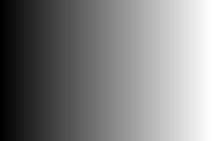

# C++ Image Processing Workshop

## Table des matières

- [Description](#description)
- [Objectifs](#objectifs)
- [Prérequis](#prérequis)
- [Exercices](#exercices)
  - [1 ⭐: Ne garder que le vert](#1)
  - [2 ⭐: Échanger les canaux](#2)
  - [3 ⭐: Noir & Blanc](#3)
  - [4 ⭐: Négatif](#4)
  - [5 ⭐: Dégradé](#5)
  - [6 ⭐⭐: Miroir](#6)
  - [7 ⭐⭐: Image bruitée](#7)
  - [8 ⭐⭐: Rotation de 90°](#8)
  - [9 ⭐⭐: RGB split](#9)
  - [10 ⭐⭐: Luminosité](#10)
  - [11 ⭐⭐⭐: Disque](#11)
  - [12 ⭐: Cercle](#12)
  - [13 ⭐: Animation](#13)
  - [14 ⭐⭐⭐: Rosace](#14)
  - [15 ⭐⭐: Mosaïque](#15)
  - [16 ⭐⭐⭐⭐: Mosaïque miroir](#16)
  - [17 ⭐⭐⭐: Glitch](#17)
  - [18 ⭐⭐⭐: Tri de pixels](#18)
  - [19 ⭐⭐⭐: Dégradés dans l'espace de couleur Lab](#19)
  - [20 ⭐⭐⭐(⭐): Fractale de Mandelbrot](#20)
  - [21 ⭐⭐⭐(⭐): Tramage](#21)
  - [22 ⭐⭐⭐(⭐): Normalisation de l'histogramme](#22)
  - [23 ⭐⭐⭐⭐: Vortex](#23)
  - [24 ⭐⭐⭐⭐: Convolutions](#24)
  - [25 ⭐⭐: Différence de gaussiennes](#25)
  - [26 ⭐⭐⭐⭐⭐: K-means](#26)
  - [27 ⭐⭐⭐⭐⭐: Filtre de Kuwahara](#27)
  - [28 ⭐⭐⭐⭐⭐⭐: Diamond Square](#28)
  - [29 ⭐⭐⭐⭐⭐⭐: Colorer la height map](#29)

---

## Description

Ce projet nous apprend à implémenter des effets sur des images (similaires à ceux de Photoshop ou Instagram) en C++. Il s'agit d'une introduction à la synthèse d'image, parfaite pour pratiquer et approfondir vos compétences en C++.  
[Lien du workshop](https://dsmte.github.io/Learn--cpp_programming/Workshop/Exercices)

## Objectifs

- Découvrir les bases du traitement d'images.
- Implémenter des effets variés (exercices de difficulté croissante).
- Rédiger un rapport en Markdown et, si souhaité, présenter un algorithme avancé.

## Prérequis

- Connaissance de base en C++.
- Environnement de développement configuré avec CMake.
- Librairie **sil** (incluse dans le template de projet).

---

## Exercices

| Exercice          | Enoncé                                                           | Difficultée | Original                                                           | Résultat                                                                       | Résultat 2                                                                       | Commentaire                                                                                                                                 |
| ----------------- | ---------------------------------------------------------------- | :---------: | ------------------------------------------------------------------ | ------------------------------------------------------------------------------ | -------------------------------------------------------------------------------- | ------------------------------------------------------------------------------------------------------------------------------------------- |
| 1   | Ne garder que le vert                                            |      ⭐      |                           |                                      | -                                                                                | Un exercice simple et rapide, idéal pour se familiariser.                                                                                   |
| 2   | Échanger les canaux                                              |      ⭐      |                           |                                       | -                                                                                | Intéressant pour mieux comprendre la manipulation des pixels.                                                                               |
| 3   | Noir & Blanc                                                     |      ⭐      |                           |                                | -                                                                                | Bonne introduction aux calculs de luminance.                                                                                                |
| 4   | Négatif                                                          |      ⭐      |                           |                                    | -                                                                                |                                                                                                                                             |
| 5   | Dégradé                                                          |      ⭐      | -                                                                  |                                    | -                                                                                |                                                                                                                                             |
| 6   | Miroir                                                           |     ⭐⭐      |                           |                                     | -                                                                                |                                                                                                                                             |
| 7   | Image bruitée                                                    |     ⭐⭐      |                           |                                      | -                                                                                |                                                                                                                                             |
| 8   | Rotation de 90°                                                  |     ⭐⭐      |                          |                             | -                                                                                |                                                                                                                                             |
| 9   | RGB split                                                        |     ⭐⭐      |                           |                                   | -                                                                                |                                                                                                                                             |
| 10 | Luminosité                                                       |     ⭐⭐      |                         |                                  |                                    |                                                                                                                                             |
| 11 | Disque                                                           |    ⭐⭐(⭐)    |                          |                                      | -                                                                                |                                                                                                                                             |
| 12 | Cercle                                                           |      ⭐      |                          |                                    | -                                                                                |                                                                                                                                             |
| 13 | Animation                                                        |      ⭐      |                          |                                 | -                                                                                |                                                                                                                                             |
| 14 | Rosace                                                           |     ⭐⭐⭐     |                        |                                    | -                                                                                |                                                                                                                                             |
| 15 | Mosaïque                                                         |     ⭐⭐      |                          |                                  | -                                                                                |                                                                                                                                             |
| 16 | Mosaïque miroir                                                  |    ⭐⭐⭐⭐     |                          |                            | -                                                                                |                                                                                                                                             |
| 17 | Glitch                                                           |     ⭐⭐⭐     |                      |                       |          | Mon effet préféré                                                                                                                           |
| 18 | Tri de pixels                                                    |     ⭐⭐⭐     | -                                                                  | -                                                                              | -                                                                                |                                                                                                                                             |
| 19 | Dégradés dans l'espace de couleur Lab                            |     ⭐⭐⭐     | -                                                                  |                              | -                                                                                |                                                                                                                                             |
| 20 | Fractale de Mandelbrot                                           |   ⭐⭐⭐(⭐)    | -                                                                  |                                  | -                                                                                | Compliqué à comprendre au début, mais sinon après je n'ai pas eu trop de problèmes                                                          |
| 21 | Tramage                                                          |   ⭐⭐⭐(⭐)    |                         |                                   | -                                                                                |                                                                                                                                             |
| 22 | Normalisation de l'histogramme                                   |   ⭐⭐⭐(⭐)    |        |                            | -                                                                                |                                                                                                                                             |
| 23 | Vortex                                                           |    ⭐⭐⭐⭐     |                          |                                    | -                                                                                |                                                                                                                                             |
| 24 | Convolutions                                                     |    ⭐⭐⭐⭐     |                          |                                      | -                                                                                |                                                                                                                                             |
| 25 | Différence de gaussiennes                                        |     ⭐⭐      | -                                                                  | -                                                                              | -                                                                                |                                                                                                                                             |
| 26 | K-means : trouver les couleurs les plus présentes dans une image |    ⭐⭐⭐⭐⭐    |                         |                    |                   | Exercice le plus difficile à mes yeux                                                                                                       |
| 27 | Filtre de Kuwahara (effet peinture à l'huile)                    |    ⭐⭐⭐⭐⭐    |                         |                                  | -                                                                                |                                                                                                                                             |
| 28 | Diamond Square                                                   |   ⭐⭐⭐⭐⭐⭐    |                                                                    |              | -                                                                                | Très satisfaisant, bonne introduction à la génération procédurale en c++                                                                    |
| 29 | Colorer la height map                                            |   ⭐⭐⭐⭐⭐⭐    |  |  |  | Ayant déjà fait de la génération procédurale en C#, cet exercice est celui où je me suis le plus amusé et où j'ai appris beaucoup de choses |

---

## Navigation

**[⬆ Retour à la table des matières](#c-image-processing-workshop)**
