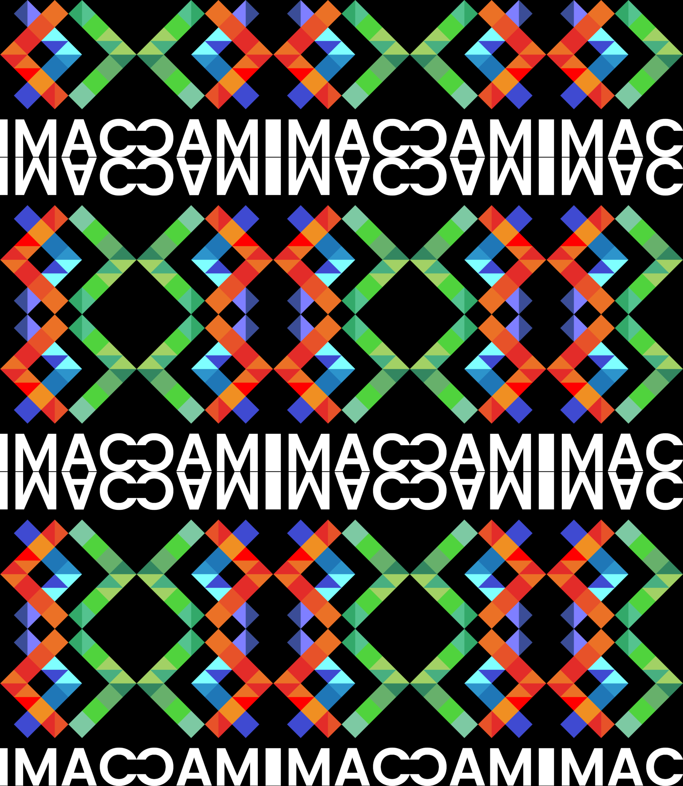

# C++ Image Processing Workshop

## Description

Ce projet nous apprend à implémenter des effets sur des images (similaires à ceux de Photoshop ou Instagram) en C++. Il s'agit d'une introduction à la synthèse d'image, parfaite pour pratiquer et approfondir vos compétences en C++.
[Lien du workshop](https://dsmte.github.io/Learn--cpp_programming/Workshop/Exercices)

## Objectifs

- Découvrir les bases du traitement d'images.
- Implémenter des effets variés (exercices de difficulté croissante).
- Rédiger un rapport en Markdown et, si souhaité, présenter un algorithme avancé.

## Prérequis

- Connaissance de base en C++.
- Environnement de développement configuré avec CMake.
- Librairie **sil** (incluse dans le template de projet).

| Exercice | Enoncé                                                           | Difficultée  | Original                                                           | Résultat                                                                       | Résultat 2                                                                       | Commentaire                                                                                                                                 |
| -------- | ---------------------------------------------------------------- | :----------: | ------------------------------------------------------------------ | ------------------------------------------------------------------------------ | -------------------------------------------------------------------------------- | ------------------------------------------------------------------------------------------------------------------------------------------- |
| 1        | Ne garder que le vert                                            |      ⭐      |                           |                                      | -                                                                                | Un exercice simple et rapide, idéal pour se familiariser.                                                                                   |
| 2        | Échanger les canaux                                              |      ⭐      |                           |                                       | -                                                                                | Intéressant pour mieux comprendre la manipulation des pixels.                                                                               |
| 3        | Noir & Blanc                                                     |      ⭐      |                           |                                | -                                                                                | Bonne introduction aux calculs de luminance.                                                                                                |
| 4        | Négatif                                                          |      ⭐      |                           |                                    | -                                                                                |                                                                                                                                             |
| 5        | Dégradé                                                          |      ⭐      | -                                                                  |                                    | -                                                                                |                                                                                                                                             |
| 6        | Miroir                                                           |     ⭐⭐     |                           |                                     | -                                                                                |                                                                                                                                             |
| 7        | Image bruitée                                                    |     ⭐⭐     |                           |                                      | -                                                                                |                                                                                                                                             |
| 8        | Rotation de 90°                                                  |     ⭐⭐     |                          |                             | -                                                                                |                                                                                                                                             |
| 9        | RGB split                                                        |     ⭐⭐     |                           |                                   | -                                                                                |                                                                                                                                             |
| 10       | Luminosité                                                       |     ⭐⭐     |                         |                                  |                                    |                                                                                                                                             |
| 11       | Disque                                                           |   ⭐⭐(⭐)   |             |                                      | -                                                                                |                                                                                                                                             |
| 12       | Cercle                                                           |      ⭐      |             |                                    | -                                                                                |                                                                                                                                             |
| 13       | Animation                                                        |      ⭐      |        |          | -                                                                                |                                                                                                                                             |
| 14       | Rosace                                                           |    ⭐⭐⭐    |           |                                    | -                                                                                |                                                                                                                                             |
| 15       | Mosaïque                                                         |     ⭐⭐     |                          |                                  | -                                                                                |                                                                                                                                             |
| 16       | Mosaïque miroir                                                  |   ⭐⭐⭐⭐   |                          |                            | -                                                                                |                                                                                                                                             |
| 17       | Glitch                                                           |    ⭐⭐⭐    |         |                       |                                                                           | Mon effet préféré                                                                                                                           |
| 18       | Tri de pixels                                                    |    ⭐⭐⭐    | -                                                                  | -                                                                              | -                                                                                |                                                                                                                                             |
| 19       | Dégradés dans l'espace de couleur Lab                            |    ⭐⭐⭐    | -                                                                  |                              | -                                                                                |                                                                                                                                             |
| 20       | Fractale de Mandelbrot                                           |  ⭐⭐⭐(⭐)  | -                                                                  |                                  | -                                                                                | Compliqué à comprendre au début, mais sinon après je n'ai pas eu trop de problèmes                                                          |
| 21       | Tramage                                                          |  ⭐⭐⭐(⭐)  |            |                                   | -                                                                                |                                                                                                                                             |
| 22       | Normalisation de l'histogramme                                   |  ⭐⭐⭐(⭐)  |        |                            | -                                                                                |                                                                                                                                             |
| 23       | Vortex                                                           |   ⭐⭐⭐⭐   |                          |                                    | -                                                                                |                                                                                                                                             |
| 24       | Convolutions                                                     |   ⭐⭐⭐⭐   |                          |                                      | -                                                                                |                                                                                                                                             |
| 25       | Différence de gaussiennes                                        |     ⭐⭐     | -                                                                  | -                                                                              | -                                                                                |                                                                                                                                             |
| 26       | K-means : trouver les couleurs les plus présentes dans une image |  ⭐⭐⭐⭐⭐  |                         |                    |                   | Exercice le plus difficile à mes yeux                                                                                                       |
| 27       | Filtre de Kuwahara (effet peinture à l'huile)                    |  ⭐⭐⭐⭐⭐  |                         |                                  | -                                                                                |                                                                                                                                             |
| 28       | Diamond Square                                                   | ⭐⭐⭐⭐⭐⭐ |                                                                    |              | -                                                                                | Très satisfaisant, bonne introduction à la génération procédurale en c++                                                                    |
| 29       | Colorer la height map                                            | ⭐⭐⭐⭐⭐⭐ |  |  |  | Ayant déjà fait de la génération procédurale en C#, cet exercice est celui où je me suis le plus amusé et où j'ai appris beaucoup de choses |
